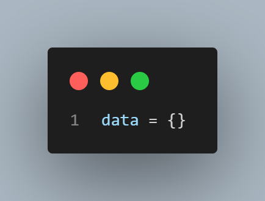
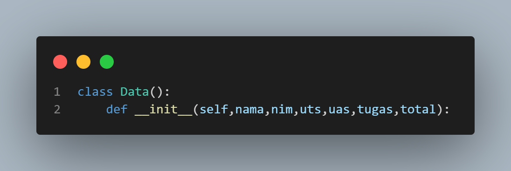
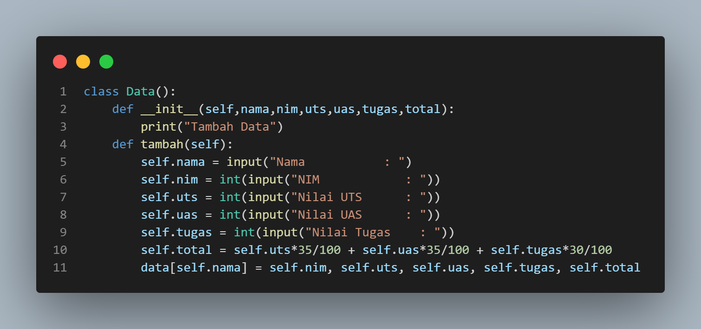
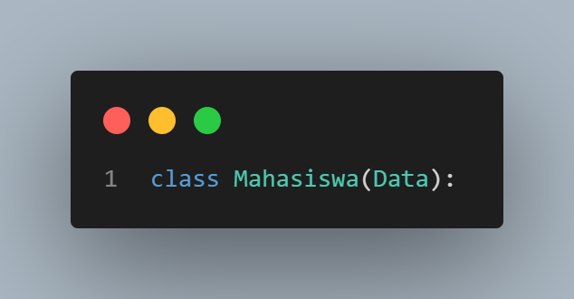
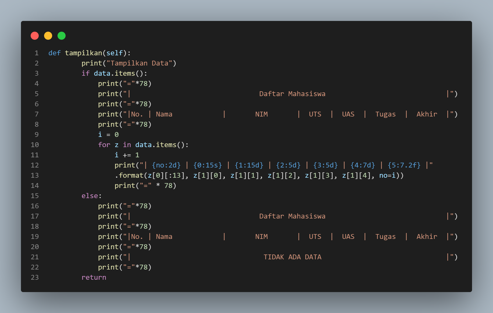
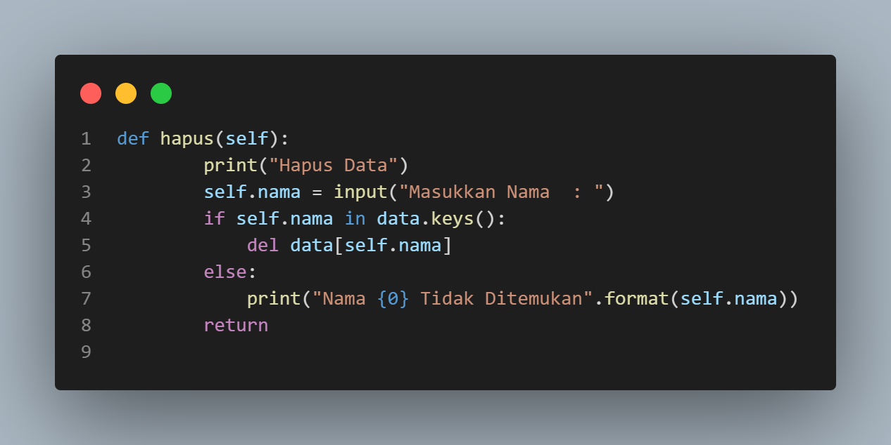
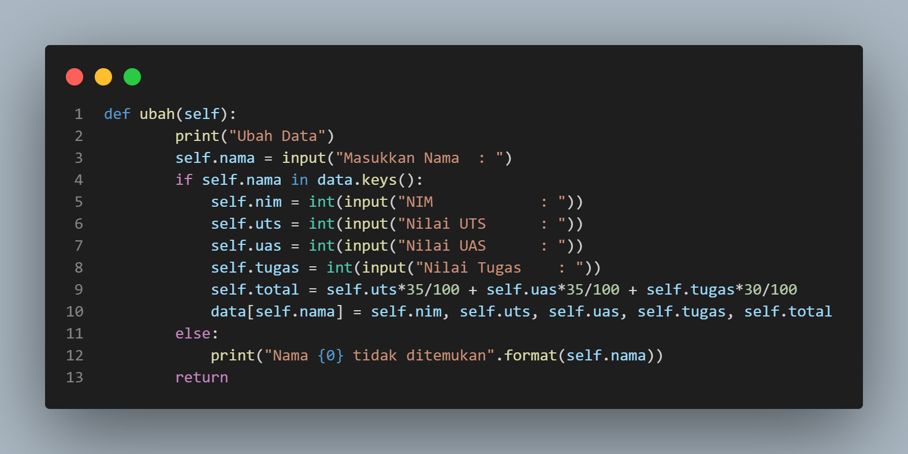
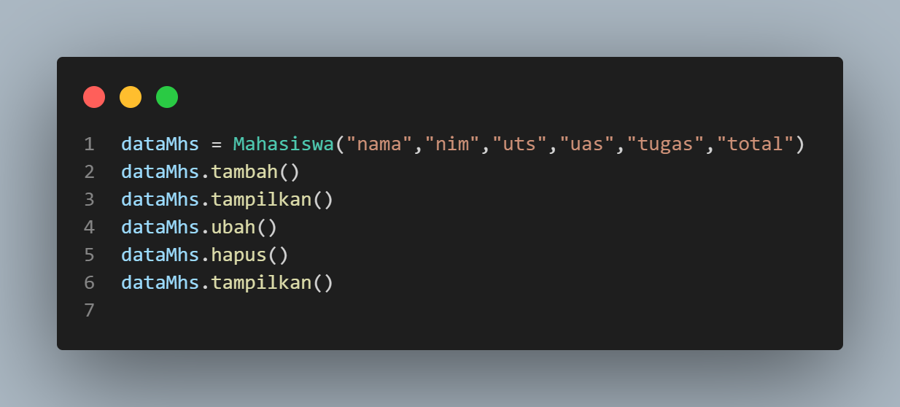
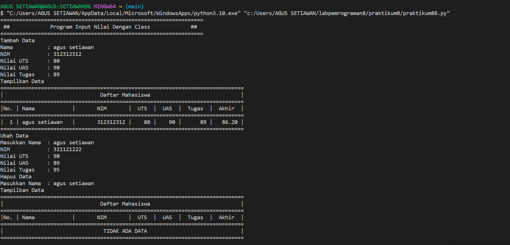
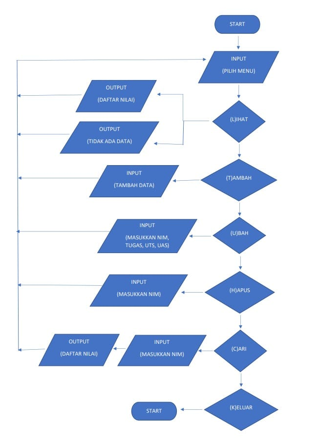

# praktikum 8
#### Buat program sederhana dengan mengaplikasikan penggunaan class. Buatlah class untuk menampilkan daftar nilai mahasiswa, dengan ketentuan :
#### 1 Method tambah() untuk menambahkan data
#### 2 Method tampilkan() untuk menampilkan data
#### 3 Method hapus() untuk mengahapus data
#### 4 Method ubah() untuk mengubah data

#### - Langkah pertama membuat dictionary kosong

#### - Membuat class untuk menampung fungsi

#### - Fungsi menambah data

#### - Fungsi class baru

#### - Fungsi menampilkan data

#### - Fungsi menghapus data

#### - Fungsi mengubah data 

#### - Code untuk memanggil data

## Output Program

## FLOWCHART

